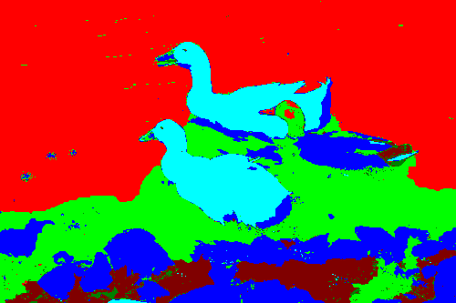

Fusing Regions
=====

	Fusing Regions - Fusing small regions to make the image more sleeky

	https://github.com/liaoxl/Fusing-Regions
	Xiangli Liao(liaoxl2012@gmail.com)
	Implemented by the meanshift image processor

### 动机

由于用`MultiLayerGraph`在`K`色染色情况下，分割得到的图片有很多碎片，故一直想找一个合并区域的算法。

譬如，以下是我对`iCoseg`数据集中某图像进行`MultiLayerGraph`的标记结果，其中碎片实在很明显，很多，这种过分割在`maxflow`算法中是没办法进行控制的，所以必须要增加一个区域合并算法。

`Meanshift`库中有`Fusing Region`这个函数，然而，该库的接口并不提供合并的细节，即哪个区域被哪个区域吞并了，并不知道，结果也最终只能得到轮廓图与区域标记，其中轮廓图如下：

在我需要的结果中，我希望，如果区域1与区域2合并，在合并中，区域1占主导（换句话说，区域1面积更大），我将会要区域2用区域1的颜色进行染色（前提是区域都是纯色），所以需要一些加工，最终的合并结果如下：

--------------------

### TODO

其实，这个合并的操作，自己写程序也能进行，不需要借助于`Meanshift`的库，可以考虑自己造轮子。
